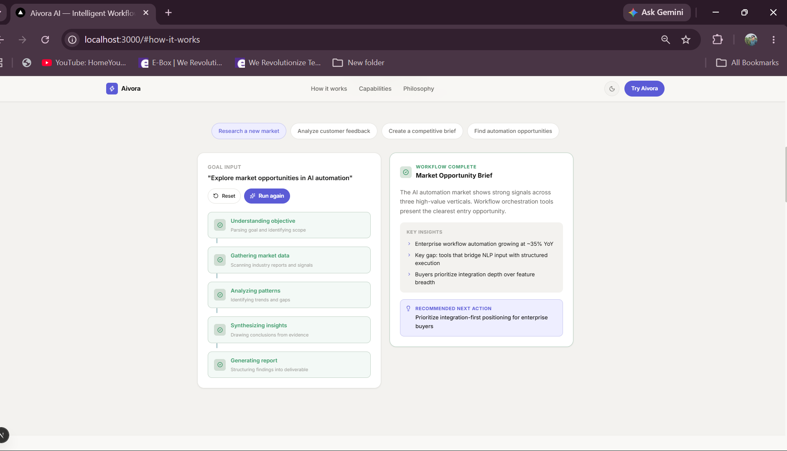
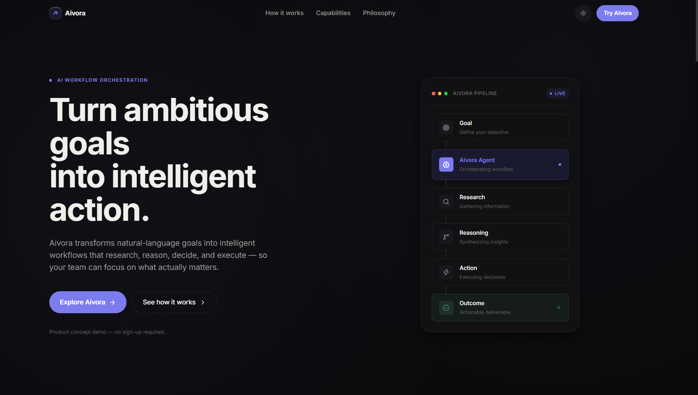
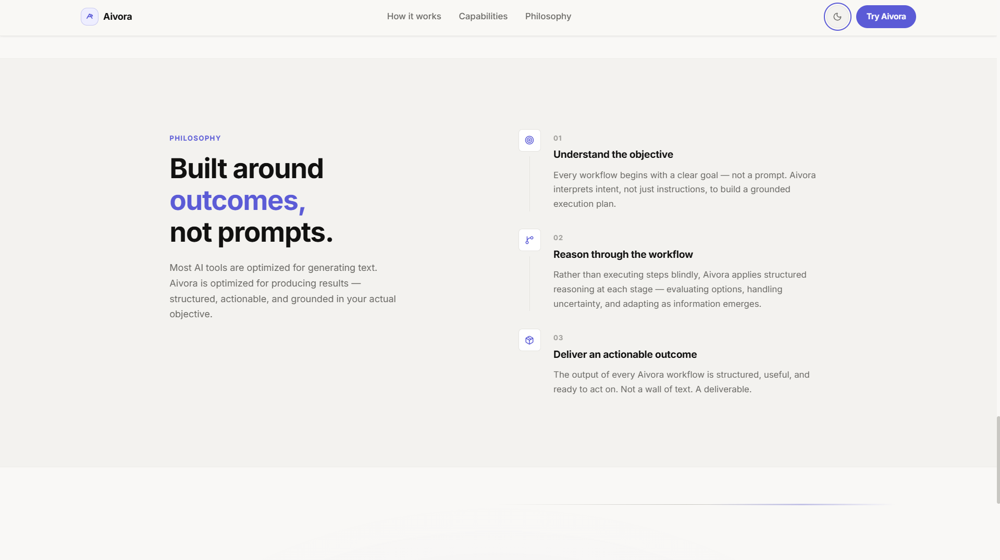
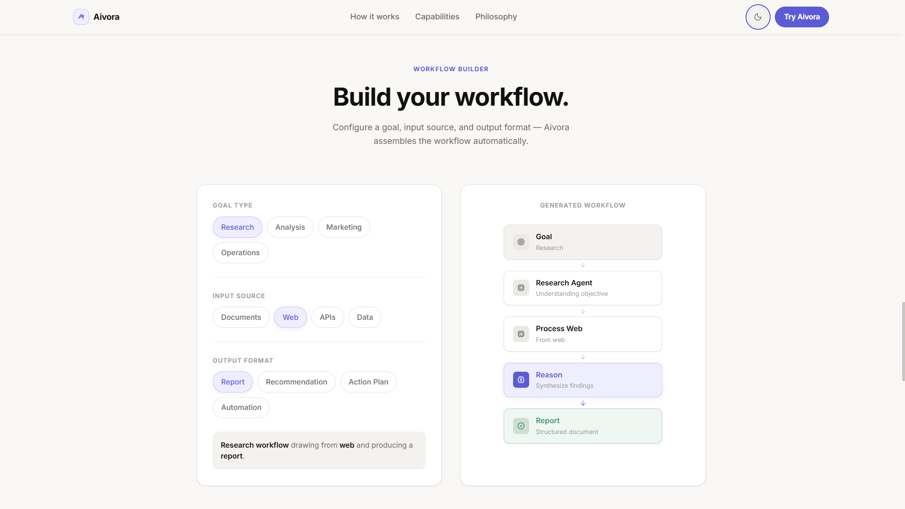
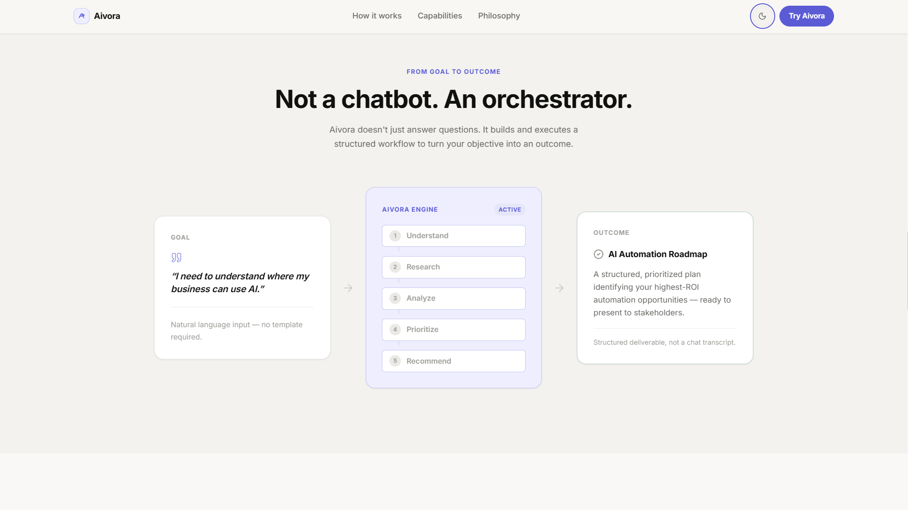
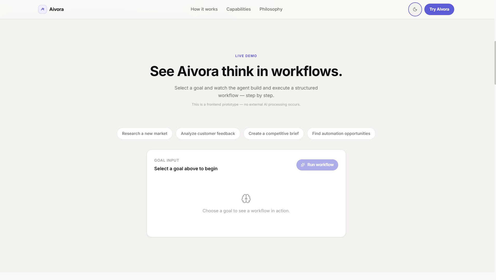

# Aivora AI

### Intelligent Workflow Orchestration

Aivora is a premium AI product concept that transforms natural-language goals into structured workflows for **research, reasoning, decision-making, and action**.

Instead of another chatbot interface, Aivora explores an **AI orchestration experience** where intelligence flows from goal to workflow to outcome.

---

## 🚀 Live Demo

**[View Live Application](https://aivora-ai-theta.vercel.app/)** · **[View GitHub Repository](https://github.com/Shresth2929/Aivora-AI)**

> Aivora is a frontend product prototype. Workflow demonstrations use deterministic mock data and do not perform real AI processing or external actions.

---

## ✨ Features

- **Interactive Workflow Demo** — Select a goal and watch a structured workflow progress step-by-step.
- **Workflow Builder** — Configure goal, input source, and output format to generate workflows.
- **Goal → Outcome Visualization** — Visualizes how an AI orchestrator processes a business objective.
- **Dark & Light Mode** — Complete theme experience across the application.
- **Premium Motion** — Purposeful Framer Motion interactions and transitions.
- **Responsive UI** — Designed for desktop, tablet, and mobile viewports.

---

## 🛠 Tech Stack

**Next.js · React · TypeScript · Tailwind CSS · Framer Motion · Lucide React · Vercel**

---

## 📸 Screenshots

### Hero — Dark Mode



### Hero — Light Mode



### Workflow Builder



### Goal → Outcome



### Capabilities



### Interactive Workflow Demo



---

## 📁 Project Structure

```text
app/            → Next.js application
components/     → Reusable UI components
lib/            → Workflow and mock data
public/         → Static assets
screenshots/    → Application screenshots
```

---

## ⚡ Getting Started

```bash
git clone https://github.com/Shresth2929/Aivora-AI.git
cd Aivora-AI
npm install
npm run dev
```

Open **http://localhost:3000** to run the application locally.

---

## 🎯 Project Focus

Aivora was built with a focus on **product thinking, frontend engineering, interaction design, responsive UI, and motion design**.

### Core Product Flow

```text
Goal
  ↓
Aivora Agent
  ↓
Research
  ↓
Reasoning
  ↓
Action
  ↓
Outcome
```

---

### Aivora AI

**Turn ambitious goals into intelligent action.**
