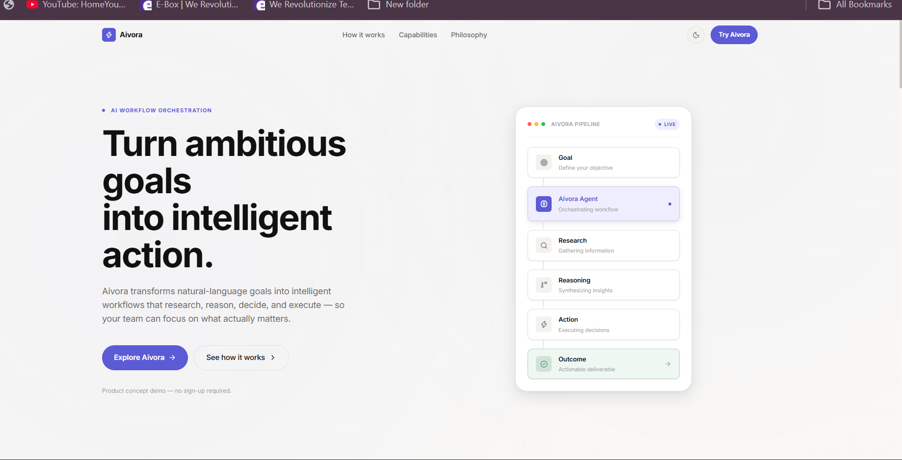
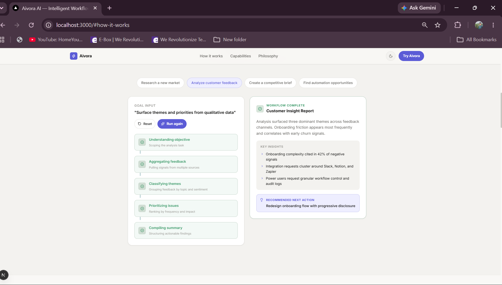
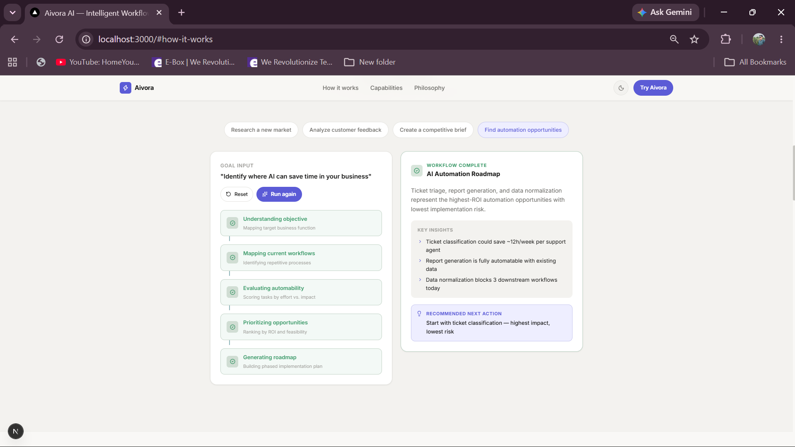
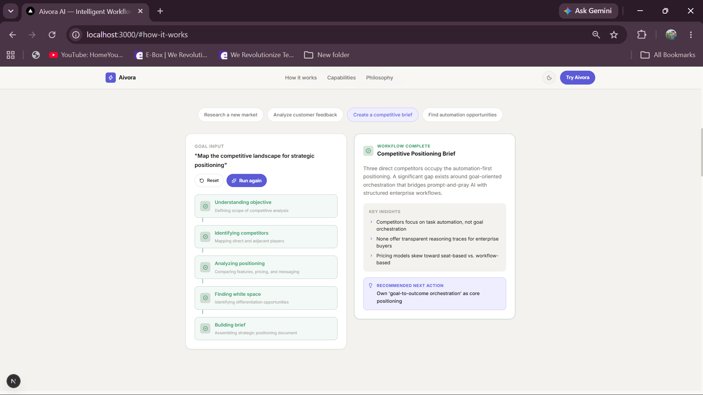
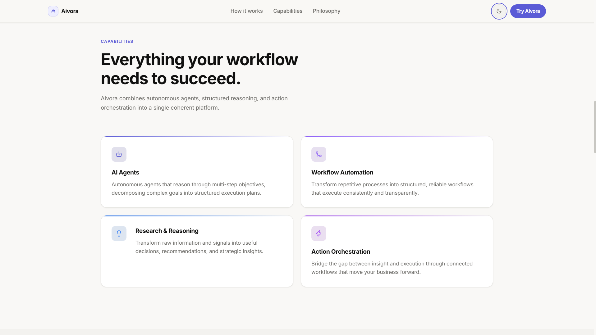

<div align="center">

# Aivora AI

### Intelligent Workflow Orchestration

**Turn ambitious goals into intelligent action.**

[](https://nextjs.org/)
[](https://react.dev/)
[](https://www.typescriptlang.org/)
[](https://tailwindcss.com/)
[](https://www.framer.com/motion/)
[](https://vercel.com/)

**[Live Demo](https://aivora-ai-theta.vercel.app/) · [GitHub](https://github.com/Shresth2929/Aivora-AI)**

</div>

---

## 📋 About Aivora

Aivora AI is a premium frontend product concept built around **AI workflow orchestration**.

Instead of treating AI as a simple chat interface, Aivora transforms a high-level goal into a structured workflow:

```text
Goal
  ↓
Aivora Agent
  ↓
Research
  ↓
Reasoning
  ↓
Action
  ↓
Outcome
```

The project focuses on product thinking, frontend engineering, interaction design, responsive layouts, and purposeful motion.

> Aivora is a frontend product prototype. The workflow demonstrations use deterministic mock data and do not perform real AI processing or external actions.

---

## 🚀 Live Demo

**[Open Aivora AI](https://aivora-ai-theta.vercel.app/)**

---

## ✨ Features

- **Interactive Workflow Demo** — Explore different workflow scenarios step-by-step.
- **Workflow Builder** — Configure goals, inputs, and outputs.
- **Goal → Outcome Visualization** — Visualize how a goal moves through the orchestration process.
- **Dark & Light Mode** — Complete theme experience.
- **Premium Motion** — Framer Motion transitions and interactions.
- **Responsive Design** — Optimized for mobile, tablet, and desktop.

---

## 🛠 Tech Stack

| Layer | Technology |
|---|---|
| Framework | Next.js, React |
| Language | TypeScript |
| Styling | Tailwind CSS |
| Motion | Framer Motion |
| Icons | Lucide React |
| Deployment | Vercel |

---

## 📸 Screenshots

### Hero — Dark Mode


### Hero — Light Mode


### Workflow Demo — Market Research


### Philosophy


### Capabilities


### Workflow Builder


### Goal → Outcome


### Interactive Workflow — Initial State


### Interactive Workflow — Market Research



### Interactive Workflow — Competitive Analysis



### Interactive Workflow — Feedback Loop



### Workflow Overview




---

## 📁 Project Structure

```text
app/            → Next.js application routes and pages
components/     → Reusable UI components
lib/            → Workflow logic and mock data
public/         → Static assets
screenshots/    → Application screenshots
```

---

## ⚡ Getting Started

```bash
git clone https://github.com/Shresth2929/Aivora-AI.git
cd Aivora-AI
npm install
npm run dev
```

Open **http://localhost:3000** to run the application locally.

---

## 🎯 Project Focus

Aivora was designed around:

- Product thinking
- Frontend engineering
- Interaction design
- Responsive UI
- Motion design
- Clean and intentional visual hierarchy

The core idea is simple:

> **Turn ambitious goals into intelligent action.**

---

<div align="center">

### Aivora AI

**Intelligence flows through Aivora.**

</div>
