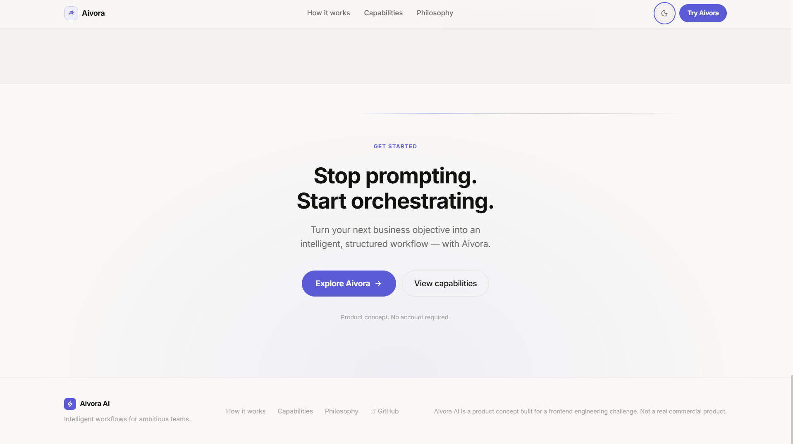

# Aivora AI

### Intelligent Workflow Orchestration

Aivora is a premium frontend product concept that transforms natural-language business goals into structured AI workflows.

Instead of a traditional chatbot interface, Aivora focuses on **orchestrating workflows from goal to outcome**.

---

## 🚀 Live Demo

**Live:** https://aivora-ai-theta.vercel.app/

**GitHub:** https://github.com/Shresth2929/Aivora-AI

> Aivora is a frontend prototype. Workflow demonstrations use deterministic mock data and do not perform real AI processing.

---

## ✨ Features

- **Interactive Workflow Demo** — Select a goal and watch a structured workflow progress through multiple stages.
- **Workflow Builder** — Configure goal type, input source, and output format to generate a workflow.
- **Goal → Outcome Visualization** — Visualizes how Aivora transforms an objective into a structured result.
- **Light / Dark Mode** — Responsive theme switching with consistent visual design.
- **Responsive UI** — Designed for mobile, tablet, and desktop viewports.
- **Motion & Micro-interactions** — Subtle transitions and animations communicate workflow state and interaction.

---

## 🛠️ Tech Stack

- Next.js
- React
- TypeScript
- Tailwind CSS
- Framer Motion
- Lucide React
- Vercel

---

## 🖼️ Screenshots

### Hero


### Live Workflow Demo


### Workflow Builder


### Goal → Outcome


### Capabilities


### Philosophy



### Dark Mode


---

## 🏗️ Project Structure

```text
app/            → Next.js application
components/     → Reusable UI components
lib/            → Mock workflow data
public/         → Static assets
screenshots/    → Application screenshots

⚙️ Getting Started
git clone https://github.com/Shresth2929/Aivora-AI.git
cd Aivora-AI
npm install
npm run dev

Open http://localhost:3000.

📌 Scope

Aivora is currently a frontend product concept and interaction prototype, focused on product design, frontend engineering, workflow visualization, and interaction quality.

Built with

Next.js · React · TypeScript · Tailwind CSS · Framer Motion

Aivora AI — Turn ambitious goals into intelligent action.


### Mere hisaab se ye better hai


**Ye wala hi use karo.** Isme reviewer ko immediately:


**What → Live Demo → Features → Tech → Screenshots → Run → Scope**


mil jata hai.


Aur **12 screenshots README mein daalne ki zarurat nahi hai**. 6–7 strong screenshots enough hain. Baaki `screenshots/` folder mein reh sakte hain.


Especially tumhare assignment ke liye **Live Demo + Workflow Builder + Goal/Outcome + Hero + Dark Mode** sabse important visuals hain.
